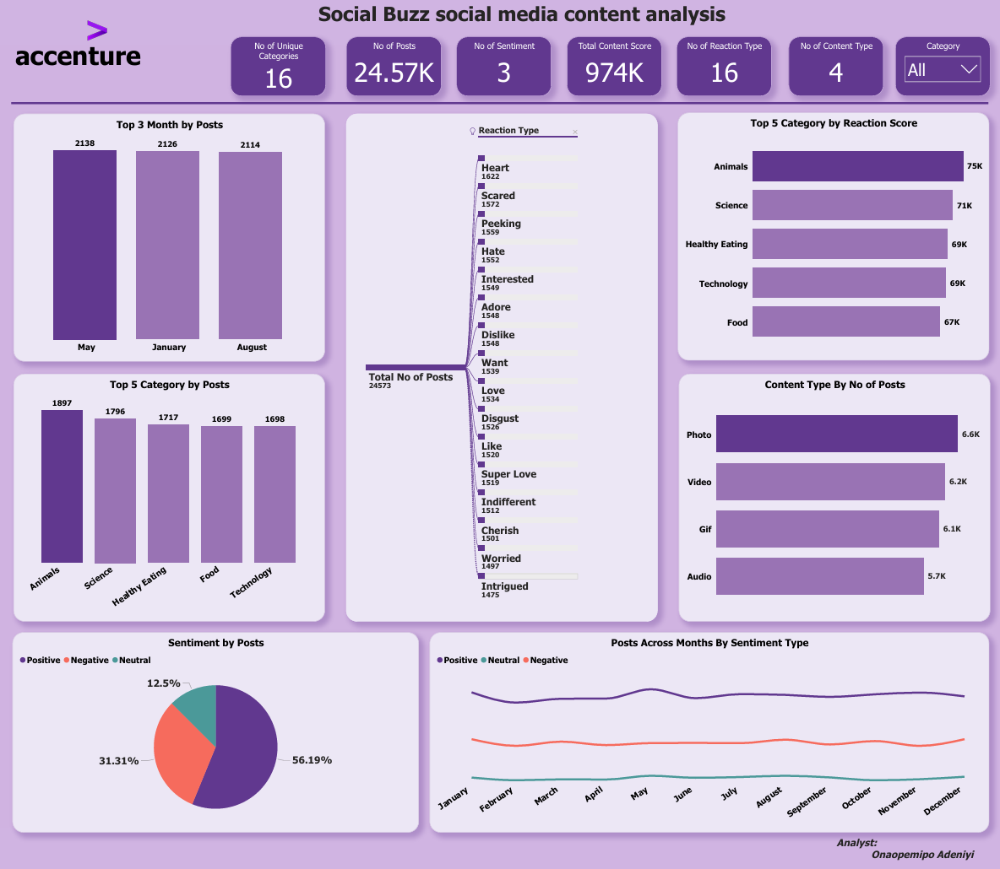

# ACCENTURE-FORAGE-PROJECT
This contains an Analysis on Accenture Social Buzz Social Media Analysis which was a task given to us by Dataleum to work on in Forage. The aim of this Analysis is to extract valuable insights as regards the excess social media data they gathered over the years. 
## Table of Content

1.0 - Introduction

2.0 - Data Source

3.0 - Tools Used

4.0 - Data Transformation

5.0 - Data Visualizations

6.0 - Insights

## 1.0 - Introduction
The Aim of the analysis aims to summarize the contents that was being posted during the period of the year. It was our task to find out the most performing contents and also the category. 

## 2.0 - Data Source
The Data Source for this Social buzz was provided on the forage dataset. The data can be found on the Accenture Data Visualization Programme. 

## 3.0 - Tools Used
3.1 -**Microsoft Excel** [Download Here](www.microsoft.com)

3.1 -**Microsoft PowerBi** [Download Here](https://www.microsoft.com/en-us/power-platform/products/power-bi/desktop)

## 4.0 - Data Transformation
Using Microsoft Excel, i was able to look the dataset and then merge columns together that were necessary for the dataset. This was necessary so that we can achieve maximum results with the analysis needed. I also checked for the relationship between them to make sure that they wrre properly connected with each other so as to avoid any discrepancies. Microsoft PowerBi was also used to perform some cleaning steps such as making sure that the casing of letters re correct. 

## 5.0 - Data Visualization
With the Dataset now properly cleaned, it was loaded to PowerBi to help for properly visualization to be done on the data. Some key insights gotten from the dataset would help Social Buzz company understand the data well. 

## 6.0 - Insights
There were some major insights gotten to help Social Buzz make their decision properly. Some of the insights include the following;
6.1 - *It showed that the No of Posts were 24.57k, Total Content Score also was 974k, No of reaction Type was 16.*

6.2 - *It Showed that the May recorded the highest month by Posts by 2,138.*

6.3 - *It also showed that the highest category was Animals with 1,897 regarding posts.*

6.4 - *It showed that Animals recorded the highest category by reaction score with 75k.*

6.5 - *It showed that 56.19% of the posts had positive sentiment in them.*

6.7 - *It showed that the highest content type as regards posts was Photo with 6.6k.*
